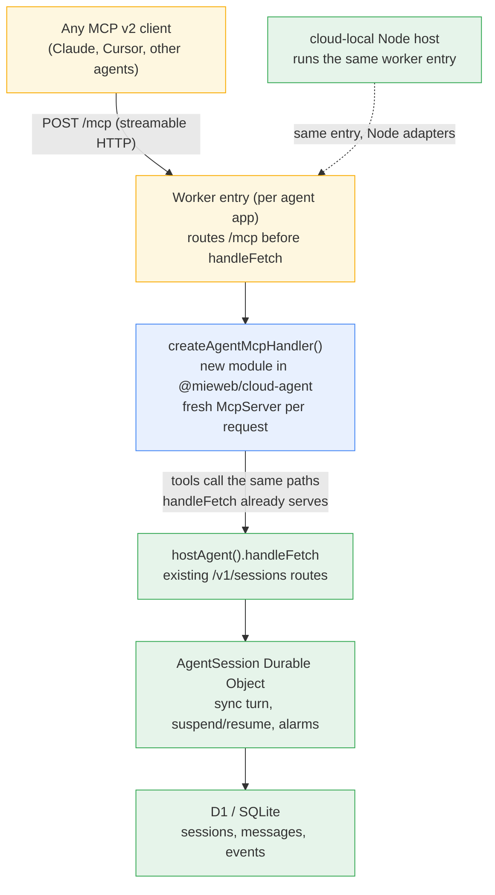

# Plan: MCP v2 handler in the `@mieweb/cloud` vendor layer

**Goal:** any agent hosted with `hostAgent()` (`@mieweb/cloud-agent`) can be exposed as an
MCP server compliant with the MCP v2 specification (2026-07-28, stateless), on every
target the portability layer supports — Cloudflare Workers as the reference
implementation and the `cloud-local` Node host with the same code.

Non-goal (for now): stateful MCP features — server-pushed requests, standalone streams,
event replay. MCP v2 is stateless-first and our tool surface doesn't need them.

## Where we start from

- `hostAgent()` returns `{ SessionClass, handleFetch, handleQueue, handleScheduled }`;
  the consuming worker composes these in its `fetch`/`queue` exports. An MCP endpoint is
  one more route composed *before* `handleFetch` — no changes to the turn lifecycle,
  Durable Object, or storage schema are required.
- Turns already run synchronously inside a single `fetch` to the session DO and return
  JSON (`{ message, status, toolsUsed, finishReason }`). That is exactly the shape a
  stateless MCP tool call wants.
- Sessions are addressed by name (`SESSION.idFromName(sessionId)`), so "which
  conversation" can travel as a plain tool argument — no MCP protocol session needed.
- On the Cloudflare side, `McpAgent` (Durable-Object-based) is **deprecated and
  feature-frozen**. The current primitive is a stateless handler built from a
  per-request MCP server factory (SDK v2, `@modelcontextprotocol/server`), which is
  fetch-shaped and web-standards based. See the
  [Cloudflare MCP v2 announcement](https://blog.cloudflare.com/mcp-v2/) and the
  [Agents SDK v0.20 changelog](https://developers.cloudflare.com/changelog/post/2026-07-27-agents-sdk-v0.20.0-mcp-sdk-v2/).

## Target architecture

The handler is **generic over the hosted agent**: it takes the same
`HostAgentConfig`/`HostAgentResult` wiring every agent already produces, so Jerry, Lisa,
or any future agent gets an MCP endpoint by composing one route — no agent-specific code
in the vendor layer.

## Decision points

### D1 — Which MCP SDK the vendor layer depends on

| Option | Pros | Cons |
| ------ | ---- | ---- |
| **`@modelcontextprotocol/server` (SDK v2) directly — recommended** | Vendor-neutral, web-standards transport, works identically under Workers and the Node host; keeps Cloudflare-only deps out of the portability layer | We own the small amount of glue (routing, CORS, legacy-lane behavior) that Cloudflare's wrapper provides |
| Cloudflare `agents/mcp/server` (`createMcpHandler`) | Workers-focused defaults (CORS, host restrictions, legacy 2025-client compatibility) for free | Adds the `agents` SDK as a dependency of the portability layer; behavior under the `cloud-local` Node host is unverified; couples the vendor contract to Cloudflare tooling — against the layer's organizing principle |

**Recommendation:** raw SDK v2. Cloudflare remains zero-overhead (the SDK is
fetch-shaped), and the same code runs under `cloud-local`. Revisit only if we end up
reimplementing a large share of the wrapper.
**Decide by:** end of Phase 0 — the spike validates the raw SDK on both targets.

### D2 — Where the handler lives

**Recommendation:** a new `src/mcp.ts` module inside `@mieweb/cloud-agent`, exported as
`createAgentMcpHandler()`. Smallest viable change, and the MCP surface is agent-hosting
logic, so `cloud-agent` is its natural anchor. Extract to a separate
`cloud-agent-mcp` package later only if the dependency footprint bothers non-MCP
consumers.

### D3 — Tool surface exposed over MCP

**Recommendation:** start with a session-oriented surface that wraps the routes
`handleFetch` already serves, rather than re-exposing the agent's internal tools:

- `send_message(sessionId, message, userId?)` → runs a turn, returns the reply,
  `status`, and `toolsUsed`
- `get_session_status(sessionId)` → current status + continuation (pending question /
  approval request)
- `resume_session(sessionId, message)` → answers a `waiting_for_user` /
  `waiting_for_approval` suspension (same code path as `send_message`; exists as a
  distinct tool so clients discover the suspend/resume contract)

Re-exposing the agent's internal tools directly over MCP is a different product
(tool-server, not agent-server) and can be a later, separate addition.

### D4 — Authentication model

The current API trusts an `X-User-Id` header — acceptable for internal use, not for an
MCP endpoint reachable by arbitrary clients.

- **Phase 2 (minimum):** static bearer token from an env binding, enforced in the MCP
  handler. Portable to every target; the Node host reads the same env.
- **Later:** OAuth (Workers OAuth Provider on Cloudflare) if MCP clients outside our
  control need to onboard. This is the piece that is Cloudflare-specific, so it must sit
  *outside* the portable handler as middleware.

**Decide by:** Phase 2. Blocking question: who are the first non-Jerry MCP clients, and
are they all first-party?

### D5 — Legacy (2025 Streamable HTTP) client compatibility

MCP v2 servers can accept stateless requests from 2025-spec clients on the same
endpoint. **Recommendation:** support the legacy stateless lane from the start (it is
close to free with SDK v2) and document that protocol-session features of the old spec
are intentionally rejected.

## Possible complications

1. **Long turns vs. request timeouts.** A turn runs up to `maxSteps: 10` LLM calls
   synchronously inside one fetch. Slow models can exceed what an MCP client (or an
   intermediary) tolerates. Mitigation: document expected latency; if it becomes real,
   add an `enqueue`-based async tool pair (`start_turn` + `get_result`) — the queue
   route already exists.
2. **Suspend/resume semantics.** `waiting_for_user` / `waiting_for_approval` are
   first-class here but foreign to MCP clients. The tool output must make the state
   machine explicit (`status` + pending message) so a generic client knows to call
   `resume_session`. Get this schema right early; it is the public contract.
3. **Per-request server instance is a security requirement, not a style choice.**
   Sharing an `McpServer`/transport across requests leaks responses between clients
   (fixed in MCP SDK ≥ 1.26). The factory pattern must be enforced in `createAgentMcpHandler`.
4. **Concurrent turns return 409.** "Turn already in progress" must map to a clean MCP
   tool error with retry guidance, not a generic failure.
5. **Node-host parity.** The MCP SDK v2 is web-standards based and should run under the
   `tsx`-loaded Node host, but this is exactly the "documented edge of the POC"
   (module-eval-time globals). The Phase 0 spike must prove it before we build on it.
6. **Streaming is discarded today.** `handleTurn` accumulates `text-delta` events and
   returns one JSON body. Fine for MCP JSON responses; if clients want incremental
   output later, that is new work in the session layer, not the MCP layer.

## Current obstacles

- **PR [#1](../../pull/1) is still open.** This work builds directly on
  `hostAgent()`; land it on top of `feature/cloud-agent` or wait for the merge.
  Per the PR philosophy, MCP support should be its own PR regardless.
- **No authentication exists anywhere in the host layer** (trusted `X-User-Id`). D4 is
  not optional for an exposed endpoint.
- **No MCP dependency in the workspace yet** — `@modelcontextprotocol/server` must be
  added to `cloud-agent` and the pnpm lockfile updated (the repo builds through
  `scripts/`, and lockfile drift already bit PR #1 once).
- **`initSchema` runs on every request**; adding MCP traffic multiplies calls to it. It
  is idempotent, but worth a cheap "already initialized" guard while we are in the area.

## Checklist

### Phase 0 — Spike: prove the transport on both targets

- [ ] Add `@modelcontextprotocol/server` (SDK v2) to `packages/cloud-agent`; update the pnpm lockfile
- [ ] Hand-wire a throwaway `/mcp` route in `packages/test-app/worker/index.mjs` with one echo tool (fresh server per request)
- [ ] Verify with an MCP v2 client against `wrangler dev` (Cloudflare lane)
- [ ] Verify the identical entry under the `cloud-local` Node host; note any module-eval-time global issues
- [ ] Confirm a 2025 stateless client is served by the same route (D5)
- [ ] Close D1 (raw SDK vs Cloudflare wrapper) with the spike's evidence

### Phase 1 — Generic handler in the vendor layer

- [ ] Create `packages/cloud-agent/src/mcp.ts` with `createAgentMcpHandler(config)` returning a fetch-shaped handler; export from `index.ts`
- [ ] Implement the session tool surface (D3): `send_message`, `get_session_status`, `resume_session` — internally calling the same logic `handleFetch` routes to
- [ ] Enforce the per-request `McpServer` factory in the API shape (complication 3)
- [ ] Map host errors to MCP tool errors, including the 409 turn-in-progress case (complication 4)
- [ ] Make suspend/resume explicit in tool output schemas: `status`, `pendingMessage`, `suspended` (complication 2)
- [ ] Unit tests alongside `storage.test.ts`; run through `./scripts/test.sh`

### Phase 2 — AuthN/AuthZ and hardening

- [ ] Close D4; implement bearer-token auth from an env binding in the MCP handler
- [ ] Reject unauthenticated requests before any tool executes; never fall back to trusting `X-User-Id` on the MCP path
- [ ] Add origin/host restrictions appropriate for each target (Workers config on Cloudflare; handler check on Node)
- [ ] Decide and document `userId` propagation from auth context into `TurnJob`

### Phase 3 — Portability parity and tests

- [ ] Extend `packages/cloud-agent/smoke` to exercise `/mcp` end-to-end on the Node host
- [ ] Add a test-app harness case: MCP client → `/mcp` → real turn → reply (both targets)
- [ ] Guard `initSchema` re-runs if profiling shows it matters

### Phase 4 — Adoption, docs, release

- [ ] Wire `/mcp` into Jerry's worker entry (one route added, nothing else)
- [ ] Prove genericity: wire the same handler into a second agent (test-app agent is enough)
- [ ] Document the MCP surface in `packages/cloud-agent/README` (tool schemas, auth, suspend/resume contract); cross-reference from `packages/README.md`
- [ ] Changeset for `@mieweb/cloud-agent`; open the PR separate from PR #1
